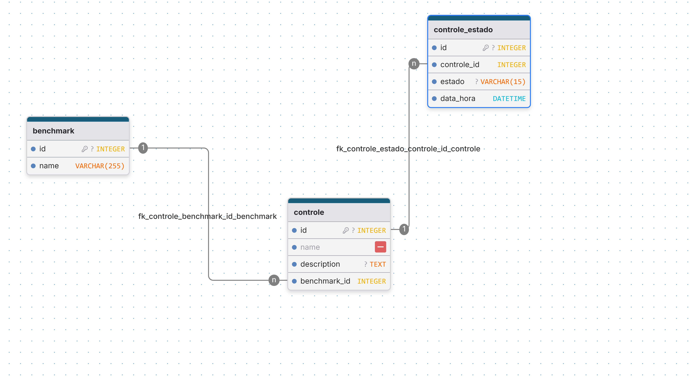

### Desafio: Banco de Dados (conceitual + índices básicos)

# ✅ **Modelo Entidade-Relacionamento (MER)**

🧠 Os principais desafios foram os trade-offs em torno de como e onde armazenar o valor `estado` (inclusive cogitei uma tabela `estado_atual`), e como isso impactaria a performance de consultas e a criação de índices. No entanto, optei por um modelo em que:

- Não há duplicação das informações de estado atual entre as entidades `controle` e `controle_estado`, mantendo a normalização e uma única fonte da verdade.
- O atributo `estado` poderia ser do tipo `enum`, `boolean`, `text`, `char` ou `varchar`; a escolha foi `varchar(15)` com garantia de integridade via **constraint CHECK**.

---

### 📌 Entidades e Atributos

**benchmark**
- `id` (PK)
- `name`

**controle**
- `id` (PK)
- `name`
- `description`
- `benchmark_id` (FK → benchmark.id)

**controle_estado**
- `id` (PK)
- `controle_id` (FK → controle.id)
- `estado` (varchar(15), `CHECK (estado IN ('ok', 'alarm'))`)
- `data_hora` (timestamp)

## 🔗 Relacionamentos

- **benchmark 1:N controle**
- **controle 1:N controle_estado**

---

## 📊 Índices

🦾 Eficiência das consultas e redução de custo computacional

### 🔍 **Q1 — Listar Benchmark com seus Controles e o estado atual**

1. **`controle_estado(controle_id, data_hora DESC)`**
   - Pois permite localizar rapidamente o último registro de estado para cada controle; assim, evita varredura completa na tabela `controle_estado`.

2. **`controle(benchmark_id)`**
   - Reduz o custo de busca por todos os controles de um benchmark específico, especialmente em joins e agrupamentos.

### 🔍 **Q2 — Listar Benchmark com seus Controles e as mudanças de estado em um intervalo**

1. **`controle_estado(data_hora)`**
   - Permite filtrar rapidamente os registros dentro de um intervalo (`BETWEEN` ou `>=` / `<=`). Sendo muito performatico por evitar leitura desnecessária de registros fora do intervalo, acelerando a consulta temporal.

2. **`controle(benchmark_id)`**
   - Necessário para agrupar os controles por benchmark com ponteiros para a consulta possa navegar eficientemente da entidade `benchmark` até os controles e seus estados.

### 🔍 **Q3 — Obter Benchmark com seus Controles e o estado em uma data/hora X**

1. **`controle_estado(controle_id, data_hora DESC)`**
   - Permite buscar o estado mais próximo anterior à data X (usando `WHERE controle_id = ? AND data_hora <= X ORDER BY data_hora DESC LIMIT 1`).Corta despedicios pois, evita varredura completa e permite que o banco use o índice para localizar rapidamente o registro mais relevante.

### 🚀 **Índices de Chave Estrangeira**

- **`controle.benchmark_id`**
- **`controle_estado.controle_id`**
- Além de garantir integridade referencial, esses índices são essenciais para **joins frequentes** entre tabelas.
- Melhoram o desempenho de consultas que partem de `benchmark` → `controle` → `controle_estado`.