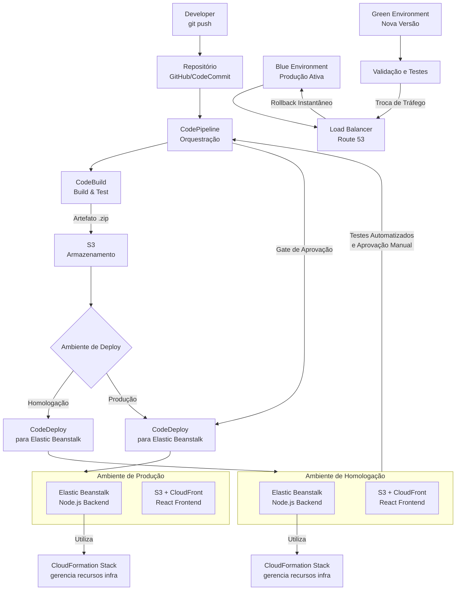

# 🚀 Desafio: Pipeline CI/CD app Node.js e React

-----

### 😑 Problema

O processo de **deploy** atual da empresa é manual e ineficiente, consumindo tempo e aumentando a chance de erros humanos. O cliente realiza o empacotamento e a implantação em dois ambientes (homologação e produção) em momentos distintos, o que gera inconsistência e atrasa a entrega de novas versões.

### 🤨 Causa

A raiz do problema está na falta de um pipeline de **CI/CD (Integração Contínua/Entrega Contínua)**. Sem essa automação, todas as etapas, desde a criação do pacote até o deploy nos servidores, são executadas manualmente. Isso não apenas torna o processo lento, mas também dificulta a rastreabilidade e a replicação de builds. O risco de um build de homologação ser diferente do de produção é alto, o que pode levar a falhas inesperadas.

### 🤩 Solução

A solução ideal é implementar um pipeline de CI/CD que automatize completamente o processo de build, teste e deploy. Isso eliminará a necessidade de intervenção manual do cliente, garantirá a consistência entre os ambientes e acelerará a entrega de novas funcionalidades.

---

## 🦾 A seguir, estão as ações e ferramentas que seriam aplicadas para automatizar esse processo:

### 1\. 🛠️ Ferramentas e Ações

**Integração Contínua (CI)**

  * **Gitlab CI/CD** ou **GitHub Actions**: Utilizaremos uma ferramenta de CI/CD para orquestrar o pipeline. Ambas são excelentes opções e se integram perfeitamente a repositórios Git.
  * **Script de Build (Frontend e Backend)**: O pipeline será configurado para executar os scripts de build do `package.json`. No caso do **Node.js (backend)**, serão executados os testes unitários e de integração, e o código será transpilado se necessário. Para o **React (frontend)**, o comando `npm run build` será usado para gerar a versão otimizada dos arquivos estáticos.
  * **Versionamento**: O pipeline também fará o versionamento automático da aplicação. Ferramentas como o **`semantic-release`** podem ser integradas para criar tags no Git e atualizar o número de versão com base nas mensagens de commit.
  * **Docker**: A aplicação será conteinerizada. Isso garante que o ambiente de execução seja idêntico em todas as etapas, desde o desenvolvimento até a produção, eliminando problemas de "funciona na minha máquina". Serão criadas duas imagens Docker: uma para o backend Node.js e outra para o frontend React.

**Entrega Contínua (CD)**

  * **Ambientes de Destino**: O pipeline será configurado para fazer o deploy em dois ambientes:
      * **Homologação**: Um ambiente de testes onde o time de QA e os stakeholders podem validar as novas funcionalidades antes do deploy em produção.
      * **Produção**: O ambiente final onde a aplicação estará disponível para os usuários.
  * **Kubernetes ou Docker Compose**: Para gerenciar o deploy dos contêineres, usaremos uma orquestração.
      * Para ambientes mais simples, o **Docker Compose** pode ser usado para orquestrar as duas imagens (backend e frontend).
      * Para ambientes mais robustos e escaláveis, o **Kubernetes** é a escolha ideal. Ele gerencia o deploy, a escala, a alta disponibilidade e a distribuição de carga de forma eficiente.
  * **Estratégia de Deploy**: Para a produção, uma estratégia como **Rolling Update** ou **Blue/Green Deployment** será aplicada para garantir zero downtime. O `Kubernetes` facilita a implementação de ambas as estratégias.
  * **Automação**: O pipeline será configurado para que, a cada novo commit na branch `main`, o processo de build e deploy em homologação seja iniciado. O deploy para produção, por sua vez, pode ser ativado manualmente após a aprovação da fase de homologação, ou automaticamente, dependendo da política de liberação da empresa.

### 2\. 🧠 Fluxo de Execução do Pipeline

1.  Um desenvolvedor faz um **`git push`** para a branch `main`.
2.  O **Gitlab CI/CD** ou **GitHub Actions** detecta o novo commit e dispara o pipeline.
3.  **Etapa de Build**: O pipeline executa os testes do backend e do frontend. Em seguida, gera os artefatos de build e as imagens Docker para ambas as partes da aplicação.
4.  **Etapa de Testes**: As imagens Docker são utilizadas para rodar testes de ponta a ponta em um ambiente temporário.
5.  **Etapa de Deploy para Homologação**: Se os testes passarem, o pipeline faz o deploy das imagens Docker no ambiente de homologação, utilizando o **Docker Compose** ou **Kubernetes**.
6.  **Aprovação Manual**: Uma notificação é enviada para o time de QA e stakeholders informando que uma nova versão está disponível em homologação. Eles têm uma semana para validar.
7.  **Etapa de Deploy para Produção**: Após a validação, um usuário com permissão aciona o deploy para produção. O pipeline utiliza as **mesmas imagens Docker** do deploy de homologação e as implanta no ambiente de produção usando a estratégia:
- No início, enquanto tem sua primeira experiencia com automatização do deploy e colher zero downtime, a melhor estratégia seria a Rolling Update, para depois adotar Blue/Green Deployment.

### 3\. 🧩 Diagrama de Arquitetura do Pipeline

```mermaid
graph TD
    subgraph Desenvolvedor
        A[Código Fonte: Node.js e React] -- Git Push --> B(Repositório Git)
    end
    
    subgraph CI/CD Pipeline
        direction TB
        B -- Trigger --> C[Job: Build Backend e Frontend]
        C -- Cria imagens --> D[Docker Images (Backend/Frontend)]
        D -- Testes Integrados --> E[Testes de Integração e E2E]
        E -- Deploy se aprovado --> F[Job: Deploy Homologação]
    end

    subgraph Ambientes
        F --> G[Ambiente de Homologação]
        G -- Aprovação Manual --> H[Job: Deploy Produção]
        H -- Rolling Update --> I[Ambiente de Produção]
    end

    subgraph Orquestração
        direction LR
        J[Kubernetes/Docker Compose]
        F -- Gerencia --> J
        H -- Gerencia --> J
    end
    
    style B fill:#f9f,stroke:#333,stroke-width:2px
    style E fill:#ccf,stroke:#333,stroke-width:2px
    style G fill:#bbf,stroke:#333,stroke-width:2px
    style I fill:#fcc,stroke:#333,stroke-width:2px

    B -- Configuração de Pipeline --> CI/CD Pipeline
    E -- Se passar, segue o fluxo --> F
```


---

# versão AWS

### 🦾 Implementação de pipeline CI/CD completo com infraestrutura como código na AWS, garantindo deploy automatizado, consistente e confiável para ambos os ambientes.

### **AWS Elastic Beanstalk e CloudFormation** - O que são e por que usar?

O **AWS Elastic Beanstalk (EB)** é um serviço de PaaS (Platform as a Service) que simplifica drasticamente o deploy e scaling de aplicações. Ele automatiza o provisionamento de infraestrutura, configuração de load balancers, auto scaling groups e monitoramento, permitindo que desenvolvedores foquem no código.

O **AWS CloudFormation** é o serviço de IaC (Infrastructure as Code) da AWS. Ele permite definir toda a infraestrutura em arquivos de template JSON ou YAML, tratando infraestrutura como software: versionável, reutilizável e testável.

**Por que usar essa combinação?**
1. **Abstração com Controle**: O EB abstrai a complexidade operacional enquanto mantém acesso total aos recursos subjacentes
2. **Consistência Absoluta**: O CloudFormation garante que ambientes de homologação e produção sejam idênticos
3. **Gerenciamento de Estado**: O CloudFormation gerencia o estado completo da infraestrutura, prevenindo configurações desviantes (configuration drift)
4. **Automação Completa**: A combinação permite automatização de deploy de aplicação e infraestrutura em um único fluxo



---

### **Arquitetura Proposta para CI/CD**

#### **1. Ferramentas e Serviços Principais**
- **Repositório de Código:** GitHub ou AWS CodeCommit
- **Orquestração de Pipeline:** AWS CodePipeline
- **Build e Teste:** AWS CodeBuild
- **Deploy Backend:** AWS Elastic Beanstalk (com CloudFormation)
- **Deploy Frontend:** AWS S3 + CloudFront
- **Gerenciamento de Secrets:** AWS Secrets Manager/Parameter Store
- **Monitoramento:** AWS CloudWatch, X-Ray
- **Estratégia de Deploy:** Blue/Green com Elastic Beanstalk

#### **2. Fluxo do Pipeline CI/CD**

**Fase 1 - Build e Teste (CI)**
- Trigger automático no push para branches específicos (main/release)
- Build simultâneo do frontend (React) e backend (Node.js)
- Execução de testes unitários, de integração e segurança
- Análise estática de código (linting, vulnerabilidades)
- Geração de artefatos de deploy (incluindo arquivos .ebextensions e appsec.yml)

**Fase 2 - Deploy para Homologação (Blue Environment)**
- Deploy automático no Elastic Beanstalk (ambiente Homolog)
- **O EB utiliza CloudFormation** para provisionar/atualizar toda a infraestrutura
- Execução de testes automatizados pós-deploy (API, integração)
- Validação de saúde da aplicação através do health check do EB
- Testes de carga e performance com AWS Lambda + CloudWatch

**Fase 3 - Aprovação e Deploy para Produção (Green Environment)**
- Gate manual para aprovação de produção com checklist
- Deploy da **mesma imagem testada** no ambiente de produção
- **Estratégia Blue/Green**: 
  - Criação de ambiente idêntico (Green) 
  - Validação final no Green
  - Troca de tráfego do Blue (atual) para Green (nova versão)
- Rollback instantâneo em caso de falha (retorno para Blue)
- Destruição do ambiente antigo (Blue anterior) após estabilização